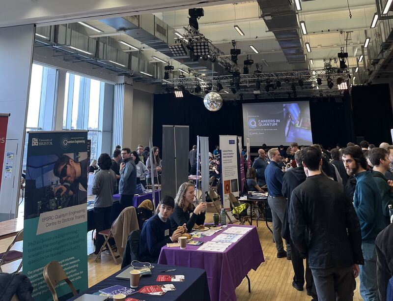

🌟 I am lucky to have recently attended the 2024 Careers in Quantum networking event, run by the Quantum Engineering Centre for Doctoral Training in collaboration with IOP Publishing and National Quantum Computing Centre (NQCC) 🌟

It was a great opportunity to connect with industry professionals and learn about the latest developments in quantum computing, cryptography, and integrated photonics. 

Looking forward to continuing my academic journey and learning more about the exciting opportunities that await!

