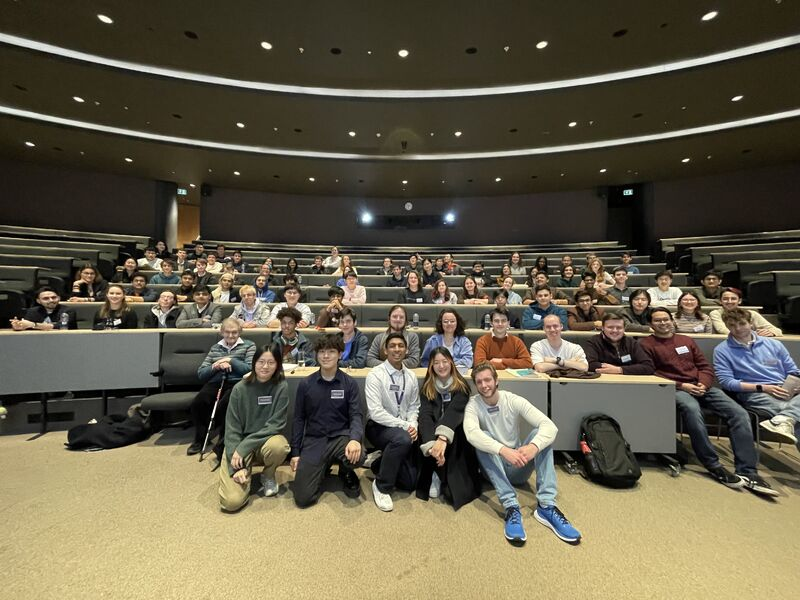

I am thrilled to share my recent adventure at the the 2024 Oxford Physics Summit – a mind-blowing fusion of cutting-edge research, spirited discussions, and endless inspiration!

This event was organised by the Oxford University Physics Society, and marks the event first of it's kind connecting aspiring young physicists across the United Kingdom. I attended talks and workshops from estemed speakers Prof Alexander Lvovsky and Dr. Ali Yildirim, and was delighted attend the closing talk by Sir Roger Penrose (2020 Nobel Prize winner), who is a personal inspiration for me.

A huge shoutout to the organizers, sponsors, and everyone who contributed to making this summit a resounding success! Your hard work and dedication to advancing the field of physics have left an indelible mark.

